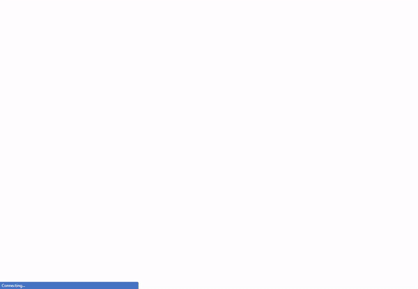

<h4 align="center">
 
 <b>Animated single page with the purpose of practing Styled-Components, framer-motion, and react-spring </b>
</h4>

  

 

### 💅🏾 Used Technologies

The following project was made using:

- [Styled-Components](https://styled-components.com/)
- [Framer-Motion](https://www.framer.com/motion/)
- [React-Spring](https://www.react-spring.io/)
- [React](https://reactjs.org/)
- [Typescript](https://www.typescriptlang.org/)
- [Lottie](https://lottiefiles.com/)

### :muscle: Project

With the use of <b>Styled-Components</b>, <b>Framer-Motion</b>, and <b>React-Spring</b> this single webpage focus animations.
Made with <b>Typescript</b>, it shows small animations that could be implemented to any website using these technologies

### 🖼️ ScreenShots:

 

---

- Fork this repository;
- Create a branch with your feature: `git checkout -b my-feature`
- Commit your changes: `git commit -m 'feat: My new feature'`
- Push your branch: `git push origin my-feature`

### :memo: License

This project is under the MIT License. See the file [LICENSE](LICENSE.md) for more details.

---

Made with love ❤️ by <b><a src="https://github.com/yamgarcia">Marcos Garcia</a></b>

